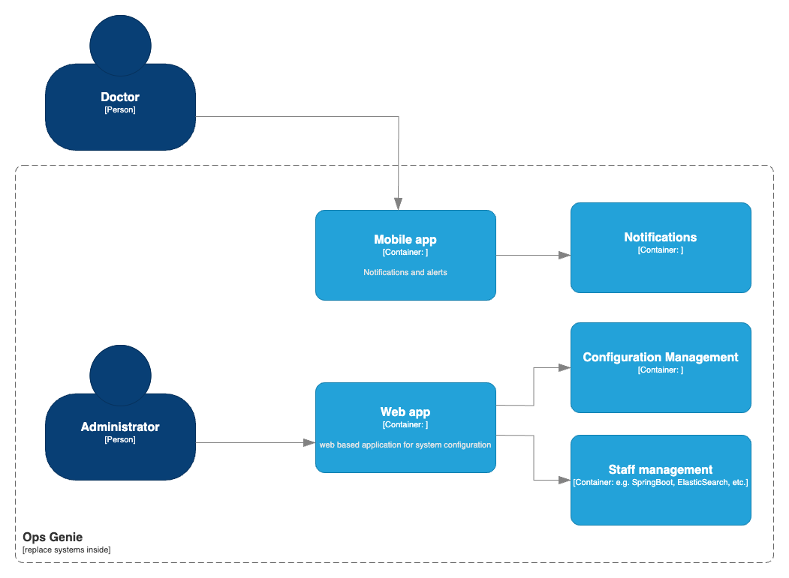

# ADR 4: OpsGenie

Date: 2024-02-13

## Status
Proposed

## Context
The decision to use OpsGenie for user management and notifications introduces dependencies on an external service that may impact the reliability and sustainability of the system.

## Decision
Utilize OpsGenie for user management, scheduling, and notifications as a proof of concept to streamline operations and enhance communication within the system.

## Consequences

### Positive
- Accelerated development and deployment of user management, scheduling, and notification features.
- Improved efficiency in managing nurses, doctors, schedules, and notifications through a dedicated platform.
- Enhanced functionality for escalating alarms and ensuring timely responses to critical events.

### Negative
- Dependency on an external service introduces potential risks related to service availability, changes in functionality, or discontinuation of the service.
- Limited customization options compared to a custom-built solution tailored specifically to the system's requirements.

### Risks
- Disruption in user management, scheduling, or notification processes in case of service unavailability or changes in OpsGenie's features.
- Lack of control over the service's evolution and potential limitations in adapting to future system needs.
